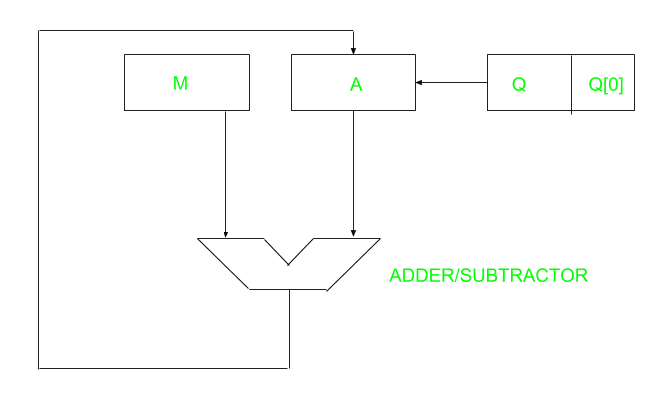
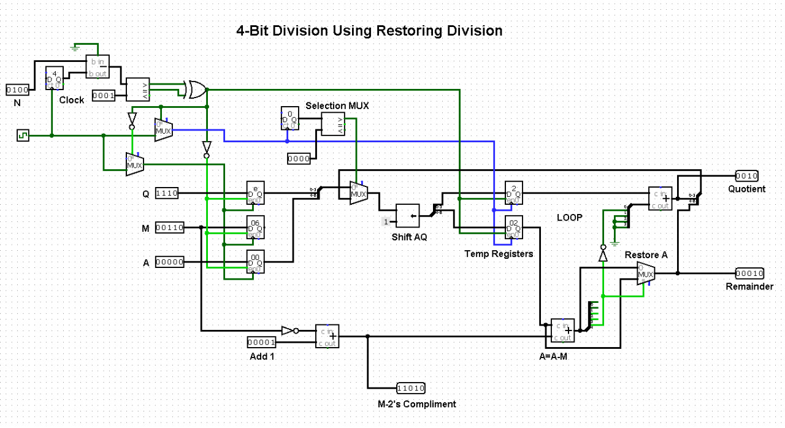

# Restoring-Division-Algorithm

## Algorithm
A division algorithm provides a quotient and a remainder when we divide two number. Restoring term is due to fact that value of register A is restored after each iteration.

 

 

This is the hardware circuit two divide numbers. In this register Q contains quotient and register A contains remainder. Here, n-bit dividend is loaded in Q and divisor is loaded in M. Value of Register is initially kept 0 and this is the register whose value is restored during iteration due to which it is named Restoring.

### Flow Chart:

  

 
 

## Circuit Design
 

 

## Requirements
* LogiSim Circuit Simulator

